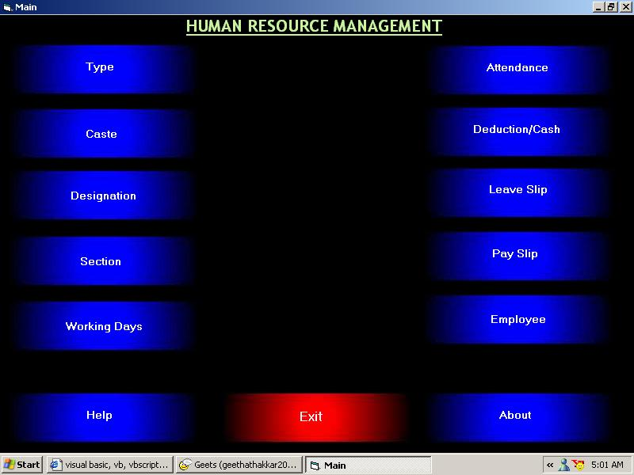



## HUMAN RESOURCE MANAGEMENT

### Description

As the title itself suggests, it is all about maintaining Employee records. This software enables an user to generate I-Cards, Payslips, Attendance Slips, Profit and Loss Analysis and much more. Graphics and Animation have been highly time consuming, but at the end, really worth spending all that time. Finaly, from the developers point of view (PSC Users), it would be very much useful if anyone is interested to learn generating Reports using Crystal Reports, Desinging animations through Macromedia Flash, and connecting MsAccess database using ADO, all through codings...good luck and best wishes for all the guys visiting PSC (my learning resource)...
 
### More Info
 

             |
---                |---
**Submitted On**   |2003-03-05 05:31:00
**By**             |[Vikrant Thakker](https://github.com/Planet-Source-Code/PSCIndex/blob/master/ByAuthor/vikrant-thakker.md)
**Level**          |Intermediate
**User Rating**    |4.6 (111 globes from 24 users)
**Compatibility**  |VB 6\.0
**Category**       |[Complete Applications](https://github.com/Planet-Source-Code/PSCIndex/blob/master/ByCategory/complete-applications__1-27.md)
**World**          |[Visual Basic](https://github.com/Planet-Source-Code/PSCIndex/blob/master/ByWorld/visual-basic.md)
**Archive File**   |[HUMAN\_RESO155484352003\.zip](https://github.com/Planet-Source-Code/vikrant-thakker-human-resource-management__1-43769/archive/master.zip)

